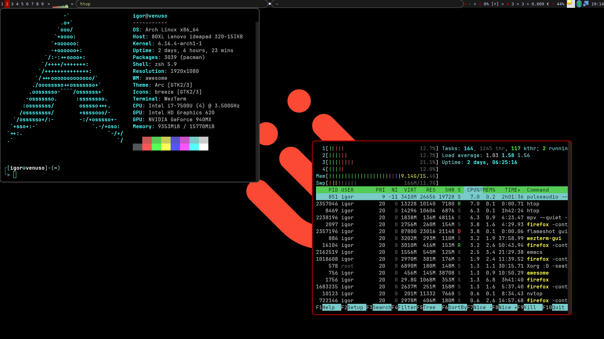
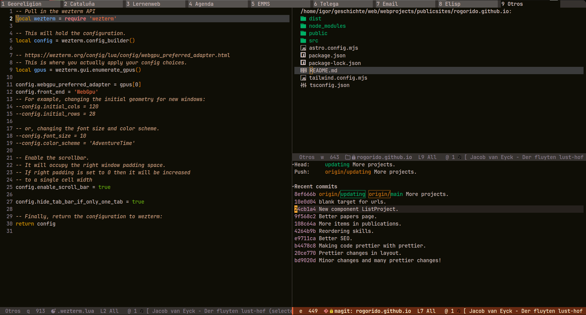

# My dotfiles

These are most of my dotfiles managed with [chezmoi](https://www.chezmoi.io/).

# What I use on my setup

| Need              | Answer                                                                                                                                             |
|-------------------|----------------------------------------------------------------------------------------------------------------------------------------------------|
| Distribution      | [Arch](https://archlinux.org/)                                                                                                                     |
| Window Manager    | [AwesomeWM](https://awesomewm.org/)                                                                                                                |
| Shell             | [zsh](https://www.zsh.org/) ([with oh-my-zsh](https://github.com/ohmyzsh/ohmyzsh/))                                                                |
| File Manager      | CLI : [ranger](https://ranger.fm/)                                                                                                                 |
| Terminal Emulator | [wezterm](https://wezterm.org/)                                                                                                                    |
| Editor            | [emacs](https://www.gnu.org/software/emacs/) of course! And sometimes [neovim](https://neovim.io/) with [lazyvim setup](https://www.lazyvim.org/)  |
| IDE               | [emacs](https://www.gnu.org/software/emacs/) with magit, project.el, etc. etc.                                                                     |
| Git TUI           | [emacs magit](https://magit.vc/) of course! and sometimes [lazygit](https://github.com/jesseduffield/lazygit), [tig](https://jonas.github.io/tig/) |
| Music             | [mpd](https://www.musicpd.org/), [emms](https://www.gnu.org/software/emms/), [navidrome](https://www.navidrome.org/)                               |

# Awesome 

# Emacs 

